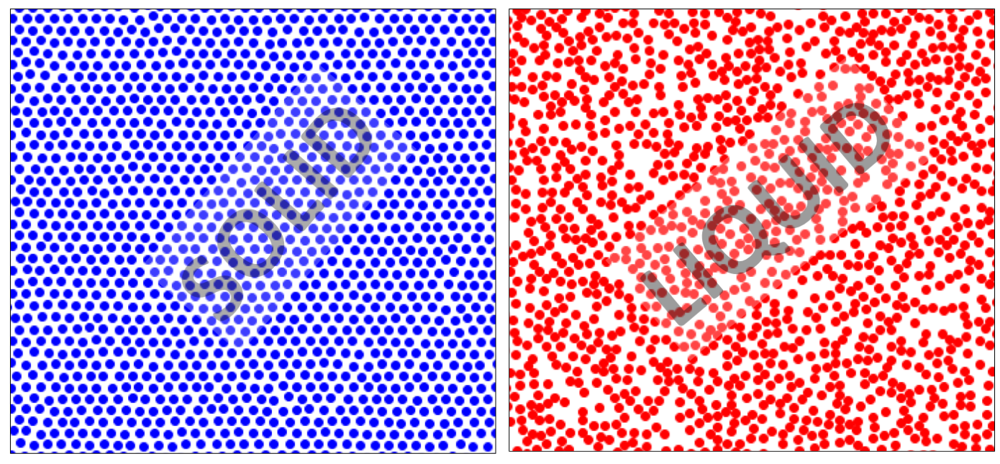

# 2DLS -  2D liquid-solid classifier

## Microscopic view of Liquid/Solid

From microscopic view point, the particles in solids (crystals) are closely packed (form lattice structure) together. In liquids, the particles are less densely packed, giving them the ability to move around and slide past each other. Can we indentify a snapshot of a liquid/solid from the coordinates of particles by a machine learning model? 

## Dataset
The dataset includes (x, y) coordinates data obtained from molecular simulation. The training set are 10500 samples of hard discs model. In test set, 3600 samples of hard discs model and 6800 sets of of LJ potential model. When train the model, we used 5-fold CV.

## Neural network (Keras version)
usage: ANN_keras/LS2D_NN.py [-h] [-d DROPRATE] [-lr LR_RATE] [-L2 L2_NROM] [-b BATCH]
[-e EPOCHS] [-m T_MODE]

ANN for solid-liquid classifier

|optional arguments                 | description                   |
| --------------------------------- |-------------------------------|
| -h, --help                        |show help message and exit|
| -d DROPRATE, --droprate DROPRATE  |Dropout rate|
| -lr LR_RATE, --lr_rate LR_RATE    |Learning rate|
| -L2 L2_NROM, --L2_nrom L2_NROM.   |L2 nrom parameters for weights|
| -b BATCH, --batch BATCH           |Batch size|
| -e EPOCHS, --epochs EPOCHS        |Epochs|
| -m T_MODE, --t_mode T_MODE.       |test mode = 0/1: Exclude/Include coexistance phase in test set|

## VGG-type convolutional neural network (Keras verion)
usage: CNN_keras/LS2D_CNN.py [-h] [-d DROPRATE] [-lr LR_RATE] [-L2 L2_NROM] [-b BATCH]
[-e EPOCHS] [-m T_MODE]

Although the above full connect NN works well for our problem, I also run a convolutional neural network with VGG-type architecture. 

## unsupervised learning -- Principal component analysis (Sk-learn)

We found the first and second principle component play as a role of ordered parameter and the susceptibility at freezing point of the solid-liquid transition.
